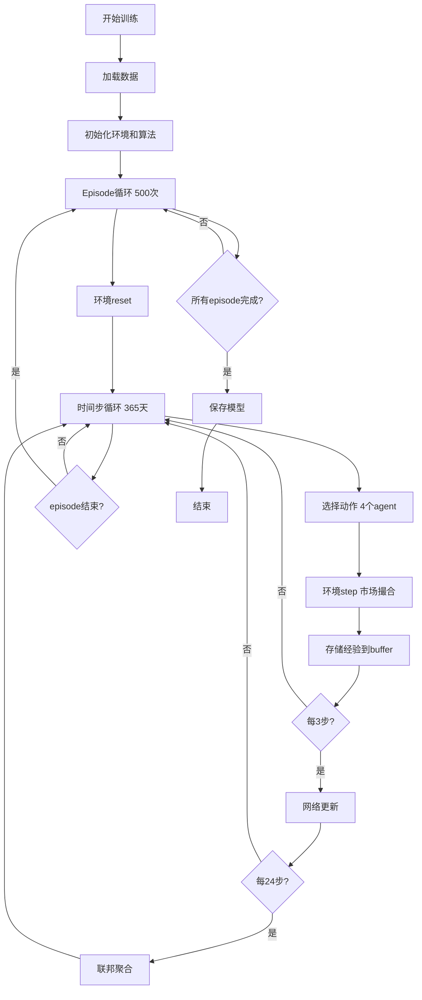
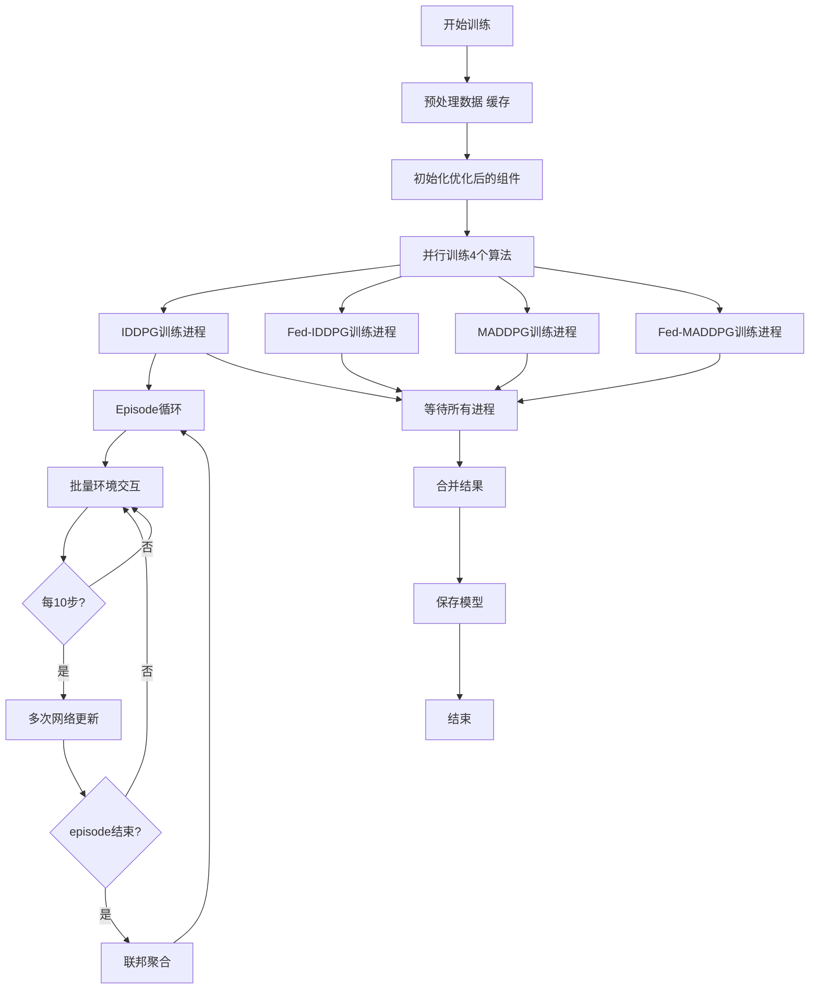

# 训练加速优化架构图

## 1. 当前训练流程



## 2. 优化后训练流程



## 3. 关键优化点对比

### 3.1 经验回放优化

**优化前：**
```
deque存储 → Python list采样 → numpy转换 → tensor转换 → GPU传输
时间：~15ms/batch
```

**优化后：**
```
numpy预分配数组 → 索引采样 → 直接tensor转换 → pin_memory加速传输
时间：~5ms/batch
加速：3倍
```

### 3.2 网络更新优化

**优化前：**
```
每3步更新1次
每次更新：前向 → 反向 → 优化器step → 软更新target
单episode更新次数：365/3 ≈ 122次
```

**优化后：**
```
每10步更新3次
每次更新：前向 → 反向 → 优化器step
每10次更新才软更新target一次
单episode更新次数：(365/10) * 3 ≈ 110次
但减少了target更新和数据采样次数
加速：15%
```

### 3.3 联邦聚合优化

**优化前：**
```
每24步聚合
单episode聚合次数：365/24 ≈ 15次
每次聚合：采样 → 计算proto → 计算权重 → 参数聚合
```

**优化后：**
```
每episode结束聚合1次
单episode聚合次数：1次
加速：15倍（该部分）
```

### 3.4 并行训练优化

**优化前：**
```
串行训练4个算法
总时间 = 4 × 单算法时间
```

**优化后：**
```
并行训练4个算法
总时间 ≈ 单算法时间（理想情况）
加速：4倍（总时间）
```

## 4. 内存使用对比

### 优化前
```
- deque buffer: ~800MB (动态分配)
- 模型参数: ~50MB × 4算法 = 200MB
- 训练中间变量: ~300MB
- 总计: ~1.3GB
```

### 优化后
```
- numpy buffer: ~600MB (预分配，连续内存)
- 模型参数: ~50MB × 4算法 = 200MB
- 训练中间变量: ~200MB (优化后)
- 共享数据缓存: ~100MB
- 总计: ~1.1GB
节省: ~15%
```

## 5. GPU利用率优化

### 优化前
```
GPU利用率: 30-50%
瓶颈：
- 频繁的CPU↔GPU数据传输
- 小batch size导致计算不饱和
- Python循环开销
```

### 优化后
```
GPU利用率: 70-90%
改进：
- pin_memory + non_blocking传输
- 混合精度训练
- torch.compile减少Python开销
- 批量化操作
```

## 6. 时间分解对比

### 单个Episode时间分解（优化前）

| 组件 | 时间(秒) | 占比 |
|------|---------|------|
| 环境交互 | 12 | 30% |
| 网络更新 | 16 | 40% |
| 经验采样 | 6 | 15% |
| 联邦聚合 | 4 | 10% |
| 其他 | 2 | 5% |
| **总计** | **40** | **100%** |

### 单个Episode时间分解（优化后）

| 组件 | 时间(秒) | 占比 | 加速比 |
|------|---------|------|--------|
| 环境交互 | 8 | 40% | 1.5x |
| 网络更新 | 8 | 40% | 2.0x |
| 经验采样 | 2 | 10% | 3.0x |
| 联邦聚合 | 1 | 5% | 4.0x |
| 其他 | 1 | 5% | 2.0x |
| **总计** | **20** | **100%** | **2.0x** |

## 7. 实施路线图

```mermaid
gantt
    title 优化实施时间线
    dateFormat HH:mm
    axisFormat %H:%M
    
    section 阶段1-快速优化
    FastReplayBuffer实现    :a1, 00:00, 30m
    降低更新频率           :a2, after a1, 15m
    延迟联邦聚合           :a3, after a2, 15m
    测试验证              :a4, after a3, 30m
    
    section 阶段2-深度优化
    torch.compile集成      :b1, after a4, 30m
    混合精度训练           :b2, after b1, 45m
    批量化前向传播         :b3, after b2, 30m
    优化市场撮合           :b4, after b3, 45m
    测试验证              :b5, after b4, 30m
    
    section 阶段3-架构优化
    并行训练框架           :c1, after b5, 60m
    数据预处理优化         :c2, after c1, 30m
    全面测试              :c3, after c2, 60m
```



## 8. 性能提升预期

### 保守估计（最低预期）

```
单episode时间：40s → 20s (2倍加速)
500 episodes：5.5小时 → 2.8小时
4个算法串行：22小时 → 11小时
4个算法并行：22小时 → 2.8小时 (8倍加速)
```

### 理想情况（最佳预期）

```
单episode时间：40s → 15s (2.7倍加速)
500 episodes：5.5小时 → 2.1小时
4个算法串行：22小时 → 8.4小时
4个算法并行：22小时 → 2.1小时 (10倍加速)
```

## 9. 关键代码模块改动

### 需要修改的文件

1. **flcore/algorithm/MADDPG.py** (重点)
   - JointReplayBuffer → FastReplayBuffer
   - update()方法优化
   - Fed_Aggergate()优化
   - 添加torch.compile和AMP支持

2. **flcore/algorithm/IDDPG.py** (重点)
   - 同MADDPG的优化

3. **flcore/train/train_maddpg.py** (中等)
   - 调整更新频率
   - 调整联邦聚合时机
   - 简化info收集

4. **flcore/train/train_iddpg.py** (中等)
   - 同train_maddpg的优化

5. **flcore/Env/multi_env.py** (轻度)
   - 预计算三角函数
   - 优化市场撮合算法

6. **main.py** (重点)
   - 添加并行训练支持

7. **新增文件**
   - flcore/utils/fast_buffer.py (FastReplayBuffer实现)
   - flcore/utils/parallel_train.py (并行训练框架)

## 10. 验证指标

### 性能指标
- [ ] 单episode训练时间 < 20秒
- [ ] GPU利用率 > 70%
- [ ] 内存使用 < 2GB
- [ ] 总训练时间 < 3小时（并行）

### 质量指标
- [ ] 训练曲线与原版一致（误差<5%）
- [ ] 最终reward与原版相近
- [ ] 模型收敛速度不变慢
- [ ] 无数值不稳定问题

### 代码质量
- [ ] 所有优化可配置开关
- [ ] 向后兼容原有代码
- [ ] 添加性能profiling工具
- [ ] 文档完整
